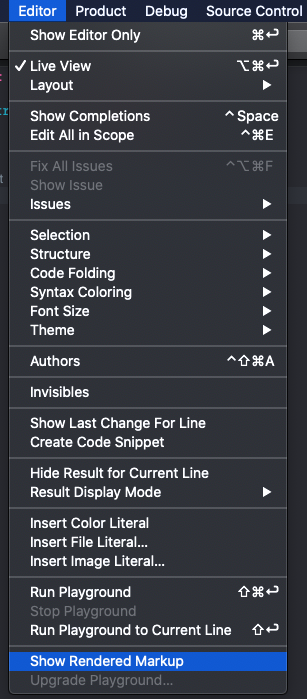
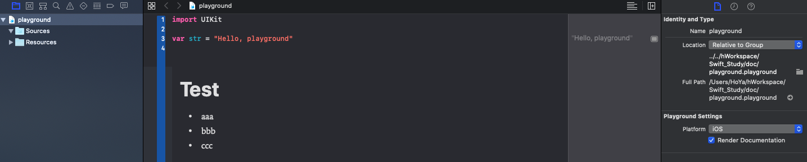

# Swift Playground

`Xcode`에서 `Playground`를 실행하면 타 언어의 REPL이나 Jupyter Notebook과 같이 swift 언어를 편하게 실행시켜볼 수 있다.

## Rich Text

`Swift`의 rich text는 markup language를 사용한다.

```swift
//: # Single line Rich Text

/*:
# Multi line Rich Text
Hello *Swift* !
* Unordered Item 1
* Unordered Item 2
*/
```

기본적으로 raw markup으로 표시되지만 다음의 방법을 이용하면 rendered markup으로 표시된다.

1. Menu > Editor > Show Rendered Markup
  
2. utility panel > Render Documentation
  
